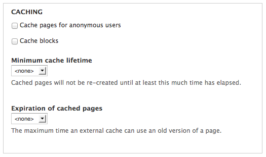

* Cache pages for anonymous users
* Minimum cache lifetime
* Expiration of cached pages

* Cache pages for anonymous users - out of the box, Drupal will only cache pages for anonymous users and you can enable that functionality here.

* Minimum cache lifetime - this sets a minimum amount of time that an object must have been cached before the cached version can be purged
  * It does not apply just to cached pages, this actually applies to all cached items in Drupal. 
  * Does not mean that after this amount of time an item will be regenerated, just purge eligible. Generally we leave this one unset as it becomes really confusing for users

* Expiration of cached pages - this one controls how long external caches (proxy servers) are advised that they may serve a page without checking back with Drupal. 
  * Again, it just controls how often external systems check back to see if a new version of a page is available.
  * This brings us to how Drupal communicates with proxy servers

